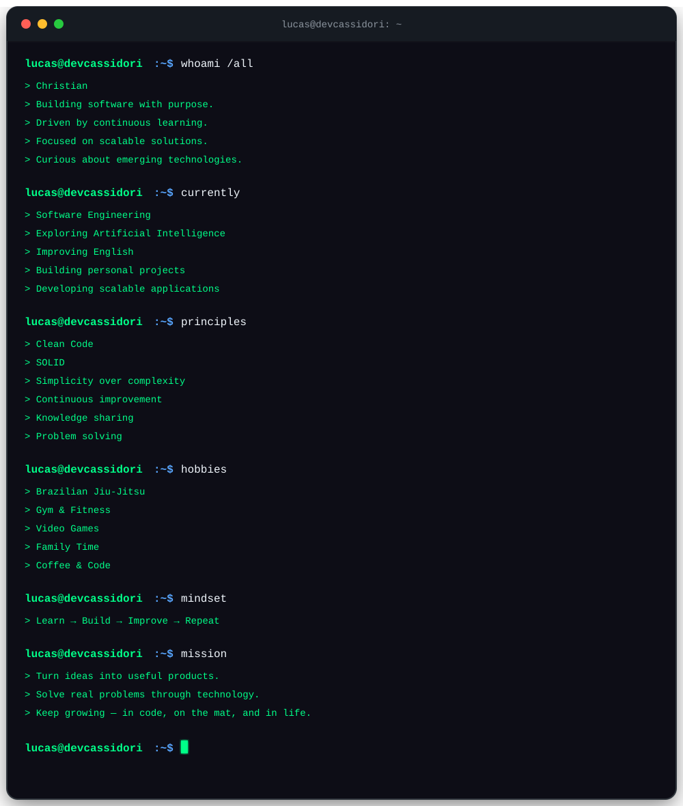

---

### `Software Engineer` • `Full Stack Developer` • `AI Enthusiast`

---

---

## 🛠️ Tech Stack

| Categoria | Stack |
|---|---|
| 💻 **Languages** |          |
| 🎨 **Front-end** |        |
| ⚙️ **Back-end** |   |
| 🗄️ **Databases** |     |
| ☁️ **Cloud & DevOps** |        |
| 🤖 **AI & Automation** |       |
| 🔌 **API & Development Tools** |       |
| 🏗️ **Architecture & Practices** | `Clean Architecture` · `Clean Code` · `SOLID` · `DDD` · `MVC` · `Microservices` · `REST APIs` · `TDD` · `DevSecOps`· `CI/CD` |

<!--
---

# 📊 GitHub Analytics

---

# 📈 Contribution Graph

-->

---

# 🌐 Connect With Me

---

# 🐍 Contribution Snake

---

## 🚀 Build the future. One line of code at a time.

